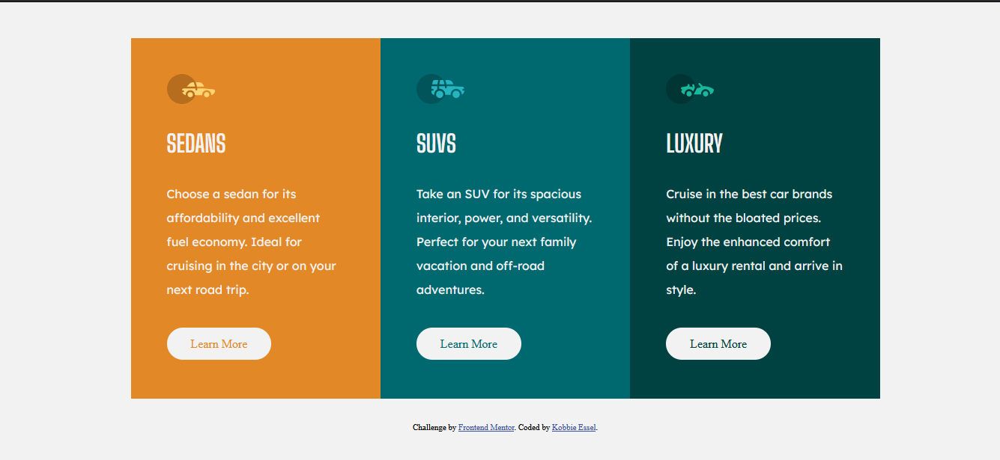

# Frontend Mentor - 3-column preview card component solution

This is a solution to the [3-column preview card component challenge on Frontend Mentor](https://www.frontendmentor.io/challenges/3column-preview-card-component-pH92eAR2-). Frontend Mentor challenges help you improve your coding skills by building realistic projects. 

## Table of contents

- [Overview](#overview)
  - [The challenge](#the-challenge)
  - [Screenshot](#screenshot)
  - [Links](#links)
- [My process](#my-process)
  - [Built with](#HTML and CSS)
- [Author](#Kobbie Essel)

## Overview

### The challenge

Users should be able to:

- View the optimal layout depending on their device's screen size
- See hover states for interactive elements

### Screenshot

### Links

- Solution URL: https://github.com/kobbieessel/3-Column-Preview-Card-Component
- Live Site URL: https://kobbieessel.github.io/3-Column-Preview-Card-Component/

## My process

### Built with

- Semantic HTML5 markup
- CSS
- Flexbox
- Mobile-first workflow

### Continued development

Layout

## Author

- Frontend Mentor - [@Kobbieessel](https://www.frontendmentor.io/profile/kobbieessel)
- Twitter - [@yourusername](https://www.twitter.com/yourusername)
